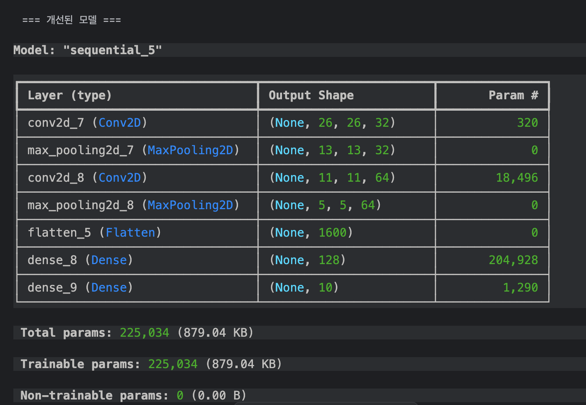
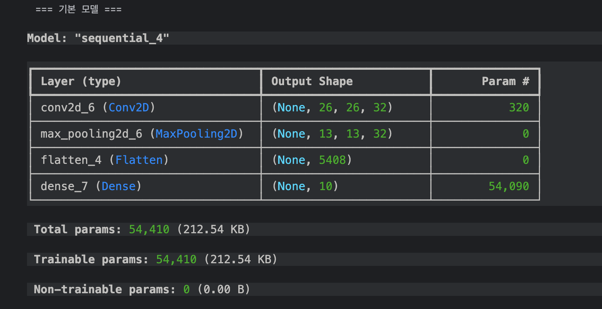
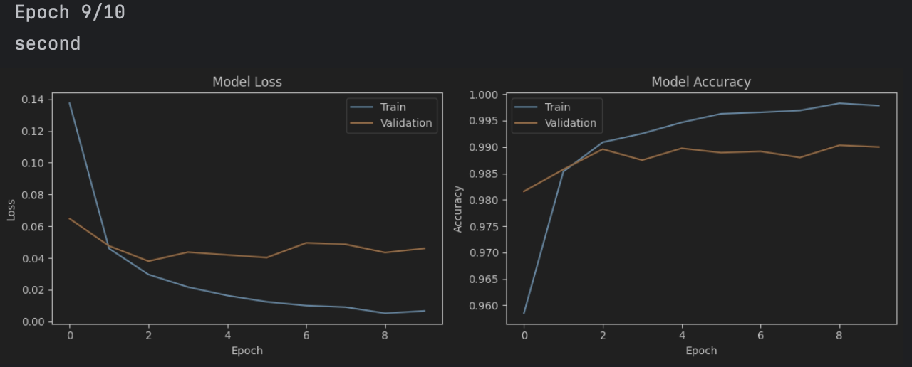
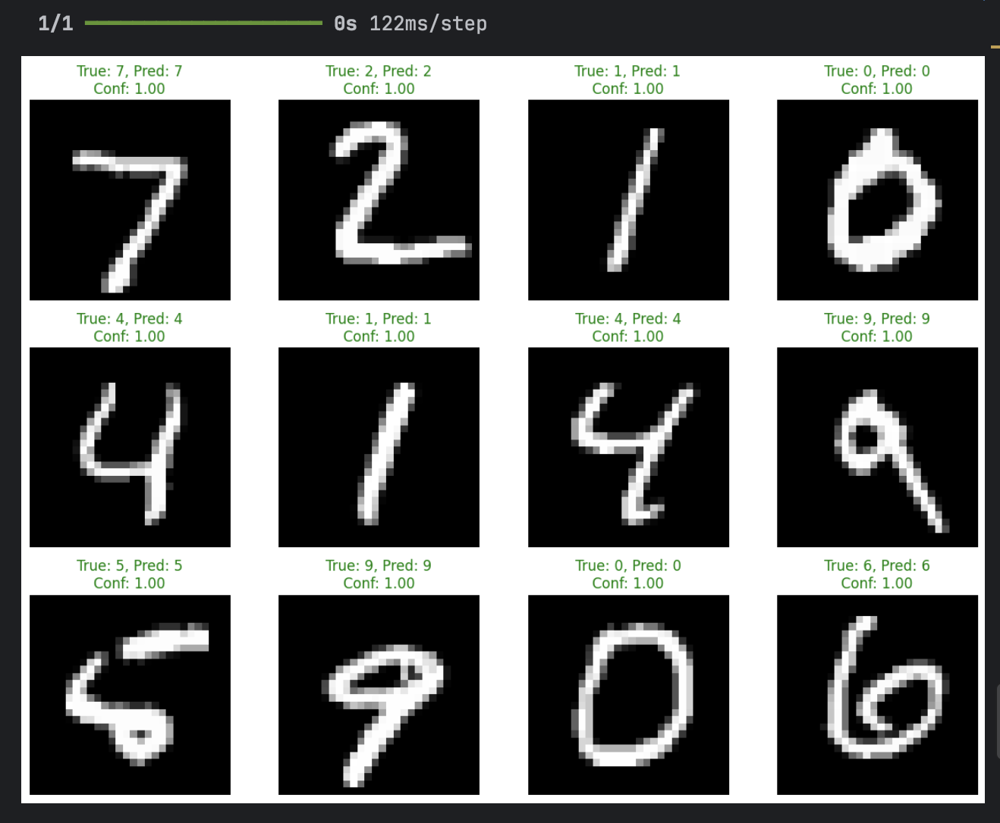

# 🧠 MNIST Digit Classification (TensorFlow CNN)

A simple **Convolutional Neural Network (CNN)** built with **TensorFlow 2.16.1** to classify handwritten digits from the MNIST dataset.

---

## 📸 Screenshots

  
  &nbsp;&nbsp;
   
  <em>Left: Training progress — Right: Model predictions</em>
   
   

> 

---

## 🧩 Overview

This project demonstrates how to:
- Load and preprocess the MNIST dataset  
- Build a **basic CNN** using Keras  
- Add improvements (extra Conv2D, MaxPooling, and Dense layers)  
- Compare model performance between the basic and improved versions  

---

